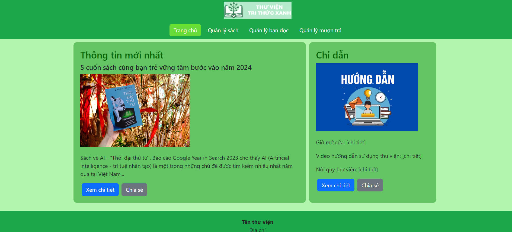
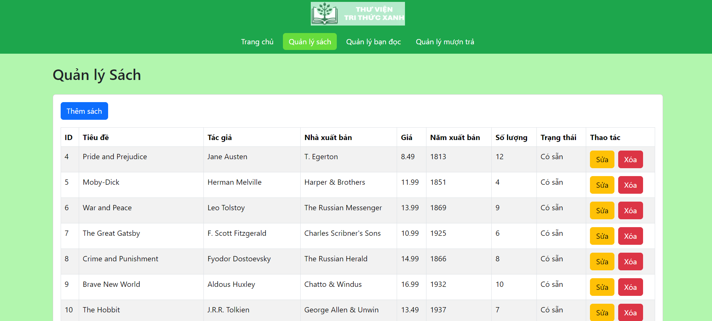
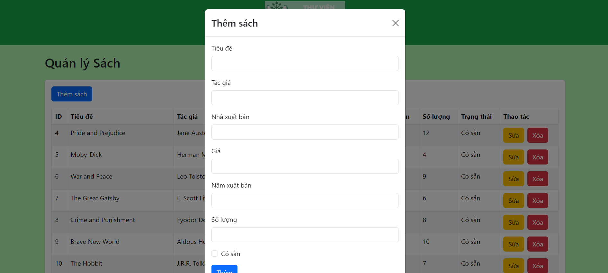
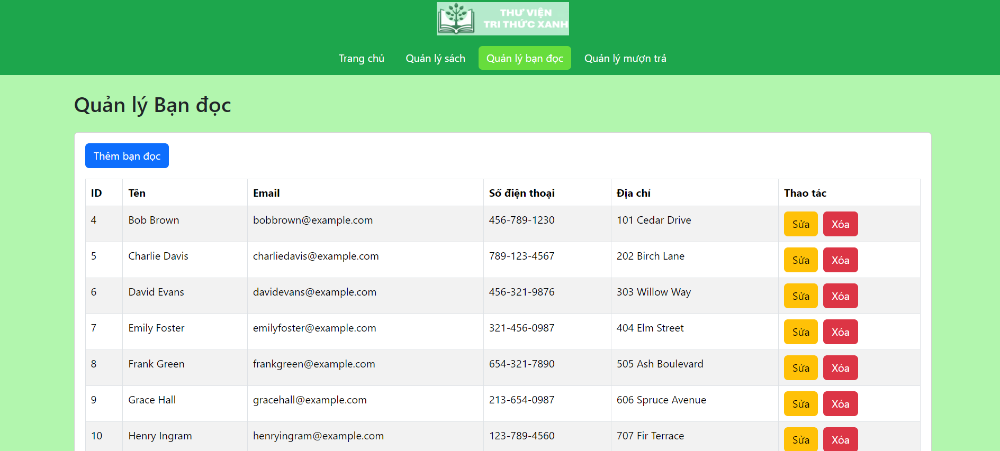
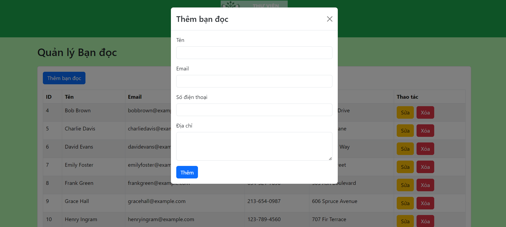
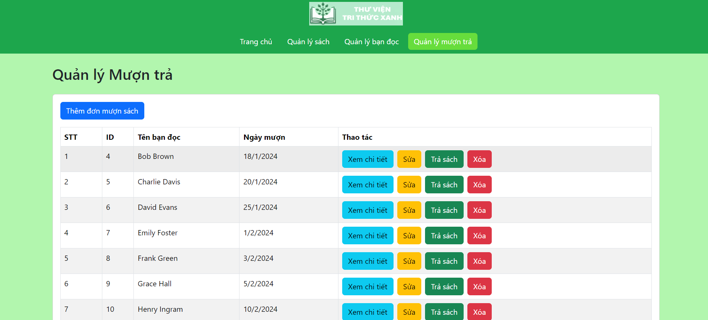
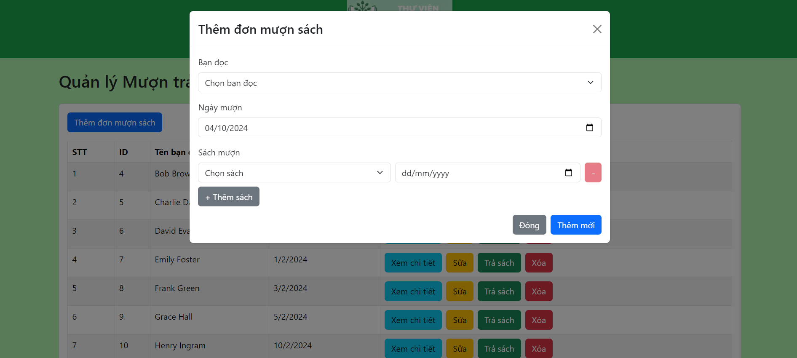
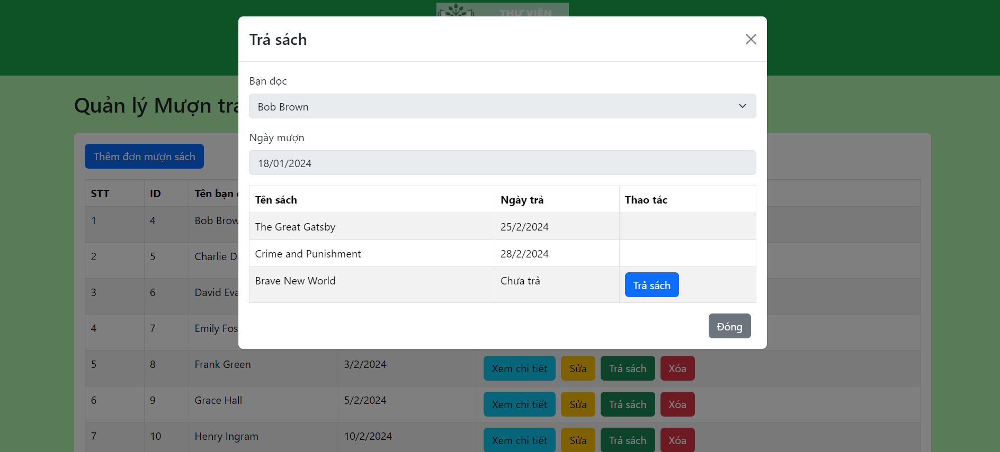

# Library Management Frontend

This project is the frontend for a Library Management System, built with React and Bootstrap.

## Features

- Manage Readers: Add, edit, and delete reader information
- Manage Books: Add, edit, and delete book information
- Manage Book Borrowing: Handle book borrowing and returning processes

## Prerequisites

Before you begin, ensure you have met the following requirements:
- Node.js (v14.0.0 or later)
- npm (v6.0.0 or later)

## Installation

1. Clone the repository
2. Navigate to the project directory
3. Install the dependencies:
   ```
   npm install
   ```

## Usage

To run the development server:

```
npm start
```

## Project Structure

- `src/components`: React components
- `src/hooks`: Custom React hooks for data fetching and state management
- `src/pages`: Page components
- `src/layouts`: Layout components

## API Integration

This frontend application interacts with a backend API. Make sure to set up and run the backend server before using this frontend. The API base URL is currently set to `http://localhost:8000` in the custom hooks.

## Demo Images

### Home Page


### Book Management


### Add Book


### Reader Management


### Add Reader


### Borrow and Return Management


### Add Borrow Request


### Return Book

